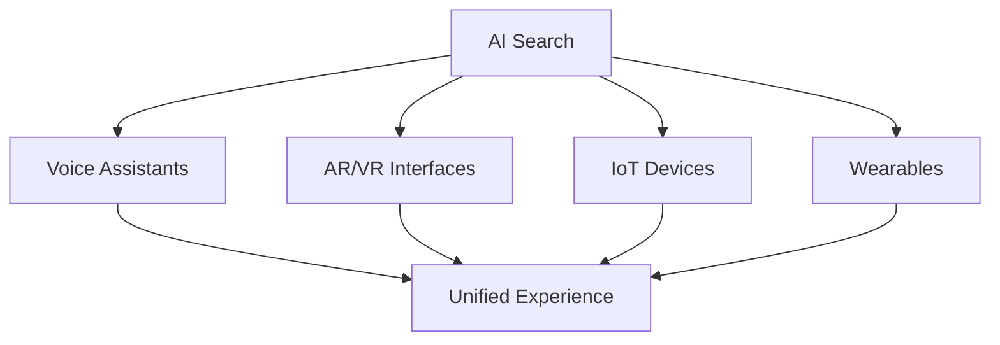

# Chapter 7: Future-Proofing Your Strategy

## Building Resilience in an AI-Driven Future

The only constant in search is change. This chapter focuses on building adaptive strategies that will help your website thrive regardless of how AI search evolves.

## Predicting Future Search Trends

### The Evolution of AI Search

**Current State (2024):**
- AI Overviews for informational queries
- Limited personalization
- Text-based responses
- Citation-based trust

**Near Future (2025-2026):**
- Conversational search interfaces
- Multi-modal AI responses
- Personalized AI assistants
- Real-time data integration

**Long-term Vision (2027+):**
- Predictive search needs
- Augmented reality integration
- Voice-first interfaces
- AI-to-AI communication

### Emerging Search Behaviors

**The Shift in User Expectations:**

1. **Zero-Click Satisfaction**
   - Complete answers in SERPs
   - Interactive AI responses
   - Dynamic information updates
   - Personalized summaries

2. **Conversational Queries**
   ```
   Traditional: "best laptop 2024"
   Conversational: "I need a laptop for video editing 
   under $1500 that's portable"
   ```

3. **Multi-Step Interactions**
   - Follow-up questions
   - Refinement queries
   - Context retention
   - Task completion focus

### Technology Convergence

**AI + Other Technologies:**



## Building Adaptive Strategies

### The Antifragile SEO Framework

**Core Principles:**

1. **Diversification Over Specialization**
   - Multiple content formats
   - Various traffic sources
   - Different monetization methods
   - Platform independence

2. **Continuous Learning Systems**
   ```python
   # Conceptual adaptation loop
   while search_evolving:
       monitor_changes()
       analyze_impact()
       test_responses()
       implement_winners()
       document_learnings()
   ```

3. **Experimentation Culture**
   - 20% resources for testing
   - Fail fast methodology
   - Data-driven decisions
   - Share learnings openly

### Content Strategy Evolution

**The CREATE Framework:**

**C**omprehensive Coverage
- Complete topic authority
- Answer all related questions
- Multiple perspective inclusion

**R**eal-time Relevance
- Dynamic content updates
- API-driven data
- User-generated freshness

**E**ngagement Optimization
- Interactive elements
- Personalization options
- Community features

**A**daptive Formats
- Text, video, audio, AR
- Device-specific versions
- Accessibility by default

**T**rust Building
- Transparent methodologies
- Verifiable credentials
- User testimonials
- Third-party validation

**E**xperimental Mindset
- Test new formats
- Pioneer platforms
- Embrace change

### Technical Adaptability

**Future-Ready Architecture:**

1. **Headless CMS Implementation**
   ```javascript
   // API-first content delivery
   const contentAPI = {
     async getContent(query, format) {
       const content = await fetch(`/api/content/${query}`);
       return formatContent(content, format);
     }
   };
   ```

2. **Microservices Approach**
   - Modular components
   - Independent scaling
   - Technology agnostic
   - Easy updates

3. **Edge Computing Ready**
   - Global CDN deployment
   - Serverless functions
   - Real-time processing
   - Personalization at edge

## Diversifying Traffic Sources

### Beyond Google Strategy

**Traffic Source Portfolio:**

```
Ideal Distribution:
- Organic Search: 40%
- Direct Traffic: 20%
- Social Media: 15%
- Email: 10%
- Referral: 10%
- Other: 5%
```

### Alternative Search Engines

**Optimization Priorities:**

1. **Bing/Microsoft**
   - Different ranking factors
   - Bing Webmaster Tools
   - Microsoft Clarity
   - LinkedIn integration

2. **DuckDuckGo**
   - Privacy-focused content
   - No personalization
   - Technical excellence
   - Clear information

3. **Vertical Search Engines**
   - Amazon (products)
   - YouTube (video)
   - Pinterest (visual)
   - Reddit (discussions)

### Social Media Evolution

**Platform-Specific Strategies:**

**TikTok SEO:**
- Hashtag optimization
- Trending audio usage
- Native content creation
- Influencer partnerships

**LinkedIn Optimization:**
- Long-form articles
- Professional insights
- Industry keywords
- Network effects

**Instagram Discovery:**
- Reels optimization
- Story highlights
- Shopping tags
- Location tags

### Building Direct Relationships

**Email List Strategies:**

1. **Value-First Approach**
   ```html
   <!-- High-converting opt-in -->
   <div class="opt-in-form">
     <h3>Get Weekly AI Search Updates</h3>
     <p>Exclusive insights not published on the blog</p>
     <form>
       <input type="email" placeholder="Your email">
       <button>Get Free Updates</button>
     </form>
   </div>
   ```

2. **Community Building**
   - Discord servers
   - Slack communities
   - Forum creation
   - Virtual events

3. **App Development**
   - Mobile apps
   - Browser extensions
   - Desktop tools
   - API access

## Continuous Learning and Adjustment

### Monitoring Systems

**Essential Tracking Setup:**

1. **AI-Specific Metrics Dashboard**
   ```javascript
   const aiMetrics = {
     overviewAppearances: trackAIAppearances(),
     citationRate: measureCitations(),
     zeroClickImpact: calculateZeroClicks(),
     voiceSearchShare: trackVoiceQueries(),
     featuredSnippets: monitorSnippets()
   };
   ```

2. **Competitive Intelligence**
   - AI visibility tracking
   - Content gap analysis
   - Technical comparisons
   - Strategy monitoring

3. **User Behavior Analytics**
   - Search journey mapping
   - Engagement patterns
   - Conversion paths
   - Feedback loops

### Experimentation Framework

**Structured Testing Approach:**

1. **Hypothesis Development**
   - Based on data insights
   - Clear success metrics
   - Defined timeframes
   - Risk assessment

2. **Test Implementation**
   ```markdown
   ## Test: Conversational Content Format
   
   Hypothesis: Conversational format increases AI citations
   
   Control: Traditional article format
   Variant: Q&A conversation style
   
   Metrics:
   - AI appearance rate
   - Citation frequency
   - User engagement
   - Conversion impact
   
   Duration: 4 weeks
   Sample Size: 10,000 sessions
   ```

3. **Learning Documentation**
   - Test results
   - Insights gained
   - Implementation guides
   - Failure lessons

### Team Development

**Skills for the Future:**

1. **Technical Skills**
   - AI/ML basics
   - Data analysis
   - Programming fundamentals
   - API integration

2. **Soft Skills**
   - Adaptability
   - Critical thinking
   - Creative problem-solving
   - Continuous learning

3. **Cross-Functional Knowledge**
   - UX principles
   - Content strategy
   - Technical SEO
   - Data science

## Building Long-Term Authority

### The Trust Equation

```
Authority = Expertise × Consistency × Time × Verification
```

**Building Blocks:**

1. **Expertise Development**
   - Original research
   - Industry partnerships
   - Speaking engagements
   - Published papers

2. **Consistency Maintenance**
   - Regular publishing
   - Quality standards
   - Brand guidelines
   - Update schedules

3. **Time Investment**
   - Long-term thinking
   - Compound effects
   - Relationship building
   - Reputation management

4. **Verification Systems**
   - Third-party audits
   - Industry certifications
   - User testimonials
   - Case study documentation

### Future-Proof Content Pillars

**Evergreen + Timely Strategy:**

1. **Foundational Content (70%)**
   - Comprehensive guides
   - Educational resources
   - Reference materials
   - Tool collections

2. **Trending Content (20%)**
   - News coverage
   - Industry updates
   - Seasonal content
   - Event coverage

3. **Experimental Content (10%)**
   - New formats
   - Emerging platforms
   - Beta features
   - Innovation tests

## Action Plan for the Future

### 90-Day Sprint

**Days 1-30: Foundation**
- Audit current vulnerabilities
- Implement monitoring systems
- Start diversification efforts
- Team training initiation

**Days 31-60: Experimentation**
- Launch test campaigns
- Try new content formats
- Explore new platforms
- Gather initial data

**Days 61-90: Optimization**
- Analyze test results
- Scale successful tactics
- Document learnings
- Plan next sprint

### Annual Planning

**Quarter 1: Assessment**
- Previous year review
- Market analysis
- Strategy adjustment
- Resource allocation

**Quarter 2: Implementation**
- New initiative launch
- Team development
- Technology upgrades
- Partnership building

**Quarter 3: Acceleration**
- Scale successes
- Optimize operations
- Expand reach
- Deepen engagement

**Quarter 4: Evolution**
- Future planning
- Innovation testing
- Knowledge sharing
- Foundation setting

## Key Takeaways

- The future of search is conversational, multimodal, and AI-driven
- Adaptability and experimentation are survival skills
- Diversification reduces platform dependency risk
- Building direct relationships provides stability
- Continuous learning is non-negotiable
- Authority building is a long-term investment
- Success requires both planning and flexibility

---

*Next: [Appendix: Resources and Tools →](appendix.md)*