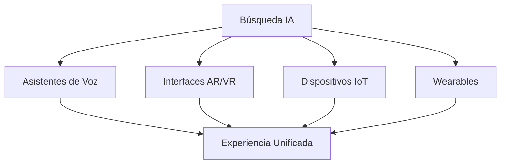

# Capítulo 7: Preparando tu Estrategia para el Futuro

## Construyendo Resiliencia en un Futuro Impulsado por IA

La única constante en la búsqueda es el cambio. Este capítulo se centra en construir estrategias adaptativas que ayudarán a tu sitio web a prosperar independientemente de cómo evolucione la búsqueda con IA.

## Prediciendo las Tendencias Futuras de Búsqueda

### La Evolución de la Búsqueda con IA

**Estado Actual (2024):**
- AI Overviews para consultas informativas
- Personalización limitada
- Respuestas basadas en texto
- Confianza basada en citas

**Futuro Cercano (2025-2026):**
- Interfaces de búsqueda conversacionales
- Respuestas de IA multimodales
- Asistentes de IA personalizados
- Integración de datos en tiempo real

**Visión a Largo Plazo (2027+):**
- Necesidades de búsqueda predictivas
- Integración de realidad aumentada
- Interfaces de voz primero
- Comunicación IA a IA

### Comportamientos de Búsqueda Emergentes

**El Cambio en las Expectativas del Usuario:**

1. **Satisfacción de Cero Clics**
   - Respuestas completas en SERPs
   - Respuestas de IA interactivas
   - Actualizaciones dinámicas de información
   - Resúmenes personalizados

2. **Consultas Conversacionales**
   ```
   Tradicional: "mejor portátil 2024"
   Conversacional: "Necesito un portátil para edición de video 
   por menos de €1500 que sea portátil"
   ```

3. **Interacciones de Múltiples Pasos**
   - Preguntas de seguimiento
   - Consultas de refinamiento
   - Retención de contexto
   - Enfoque en completar tareas

### Convergencia Tecnológica

**IA + Otras Tecnologías:**



## Construyendo Estrategias Adaptativas

### El Marco SEO Antifrágil

**Principios Fundamentales:**

1. **Diversificación Sobre Especialización**
   - Múltiples formatos de contenido
   - Varias fuentes de tráfico
   - Diferentes métodos de monetización
   - Independencia de plataforma

2. **Sistemas de Aprendizaje Continuo**
   ```python
   # Bucle de adaptación conceptual
   while busqueda_evolucionando:
       monitorear_cambios()
       analizar_impacto()
       probar_respuestas()
       implementar_ganadores()
       documentar_aprendizajes()
   ```

3. **Cultura de Experimentación**
   - 20% de recursos para pruebas
   - Metodología de fallar rápido
   - Decisiones basadas en datos
   - Compartir aprendizajes abiertamente

### Evolución de la Estrategia de Contenido

**El Marco CREAR:**

**C**obertura Completa
- Autoridad completa del tema
- Responder todas las preguntas relacionadas
- Inclusión de múltiples perspectivas

**R**elevancia en Tiempo Real
- Actualizaciones dinámicas de contenido
- Datos impulsados por API
- Frescura generada por usuarios

**E**ngagement Optimizado
- Elementos interactivos
- Opciones de personalización
- Características comunitarias

**A**daptación de Formatos
- Texto, video, audio, AR
- Versiones específicas por dispositivo
- Accesibilidad por defecto

**R**eforzar Confianza
- Metodologías transparentes
- Credenciales verificables
- Testimonios de usuarios
- Validación de terceros

### Adaptabilidad Técnica

**Arquitectura Lista para el Futuro:**

1. **Implementación de CMS Headless**
   ```javascript
   // Entrega de contenido API-first
   const contentAPI = {
     async getContent(consulta, formato) {
       const contenido = await fetch(`/api/content/${consulta}`);
       return formatearContenido(contenido, formato);
     }
   };
   ```

2. **Enfoque de Microservicios**
   - Componentes modulares
   - Escalado independiente
   - Agnóstico de tecnología
   - Actualizaciones fáciles

3. **Listo para Edge Computing**
   - Despliegue CDN global
   - Funciones serverless
   - Procesamiento en tiempo real
   - Personalización en el edge

## Diversificando las Fuentes de Tráfico

### Estrategia Más Allá de Google

**Portafolio de Fuentes de Tráfico:**

```
Distribución Ideal:
- Búsqueda Orgánica: 40%
- Tráfico Directo: 20%
- Redes Sociales: 15%
- Email: 10%
- Referencias: 10%
- Otros: 5%
```

### Motores de Búsqueda Alternativos

**Prioridades de Optimización:**

1. **Bing/Microsoft**
   - Diferentes factores de clasificación
   - Bing Webmaster Tools
   - Microsoft Clarity
   - Integración con LinkedIn

2. **DuckDuckGo**
   - Contenido enfocado en privacidad
   - Sin personalización
   - Excelencia técnica
   - Información clara

3. **Motores de Búsqueda Verticales**
   - Amazon (productos)
   - YouTube (video)
   - Pinterest (visual)
   - Reddit (discusiones)

### Evolución de Redes Sociales

**Estrategias Específicas por Plataforma:**

**SEO en TikTok:**
- Optimización de hashtags
- Uso de audio tendencia
- Creación de contenido nativo
- Asociaciones con influencers

**Optimización en LinkedIn:**
- Artículos de formato largo
- Perspectivas profesionales
- Palabras clave de la industria
- Efectos de red

**Descubrimiento en Instagram:**
- Optimización de Reels
- Historias destacadas
- Etiquetas de compra
- Etiquetas de ubicación

### Construyendo Relaciones Directas

**Estrategias de Lista de Email:**

1. **Enfoque de Valor Primero**
   ```html
   <!-- Opt-in de alta conversión -->
   <div class="formulario-opt-in">
     <h3>Recibe Actualizaciones Semanales de Búsqueda IA</h3>
     <p>Perspectivas exclusivas no publicadas en el blog</p>
     <form>
       <input type="email" placeholder="Tu email">
       <button>Obtener Actualizaciones Gratis</button>
     </form>
   </div>
   ```

2. **Construcción de Comunidad**
   - Servidores Discord
   - Comunidades Slack
   - Creación de foros
   - Eventos virtuales

3. **Desarrollo de Aplicaciones**
   - Aplicaciones móviles
   - Extensiones de navegador
   - Herramientas de escritorio
   - Acceso API

## Aprendizaje y Ajuste Continuo

### Sistemas de Monitoreo

**Configuración de Seguimiento Esencial:**

1. **Dashboard de Métricas Específicas de IA**
   ```javascript
   const metricasIA = {
     aparicionesOverview: rastrearAparicionesIA(),
     tasaCitas: medirCitas(),
     impactoCeroClics: calcularCeroClics(),
     participacionBusquedaVoz: rastrearConsultasVoz(),
     fragmentosDestacados: monitorearFragmentos()
   };
   ```

2. **Inteligencia Competitiva**
   - Seguimiento de visibilidad de IA
   - Análisis de brechas de contenido
   - Comparaciones técnicas
   - Monitoreo de estrategias

3. **Analítica de Comportamiento del Usuario**
   - Mapeo del viaje de búsqueda
   - Patrones de compromiso
   - Rutas de conversión
   - Bucles de retroalimentación

### Marco de Experimentación

**Enfoque de Pruebas Estructurado:**

1. **Desarrollo de Hipótesis**
   - Basado en insights de datos
   - Métricas claras de éxito
   - Marcos de tiempo definidos
   - Evaluación de riesgos

2. **Implementación de Pruebas**
   ```markdown
   ## Prueba: Formato de Contenido Conversacional
   
   Hipótesis: El formato conversacional aumenta las citas de IA
   
   Control: Formato de artículo tradicional
   Variante: Estilo conversacional Q&A
   
   Métricas:
   - Tasa de aparición en IA
   - Frecuencia de citas
   - Compromiso del usuario
   - Impacto en conversión
   
   Duración: 4 semanas
   Tamaño de muestra: 10,000 sesiones
   ```

3. **Documentación de Aprendizaje**
   - Resultados de pruebas
   - Perspectivas obtenidas
   - Guías de implementación
   - Lecciones de fracasos

### Desarrollo del Equipo

**Habilidades para el Futuro:**

1. **Habilidades Técnicas**
   - Básicos de IA/ML
   - Análisis de datos
   - Fundamentos de programación
   - Integración de API

2. **Habilidades Blandas**
   - Adaptabilidad
   - Pensamiento crítico
   - Resolución creativa de problemas
   - Aprendizaje continuo

3. **Conocimiento Multifuncional**
   - Principios de UX
   - Estrategia de contenido
   - SEO técnico
   - Ciencia de datos

## Construyendo Autoridad a Largo Plazo

### La Ecuación de Confianza

```
Autoridad = Experiencia × Consistencia × Tiempo × Verificación
```

**Bloques de Construcción:**

1. **Desarrollo de Experiencia**
   - Investigación original
   - Asociaciones industriales
   - Compromisos para hablar
   - Documentos publicados

2. **Mantenimiento de Consistencia**
   - Publicación regular
   - Estándares de calidad
   - Directrices de marca
   - Calendarios de actualización

3. **Inversión de Tiempo**
   - Pensamiento a largo plazo
   - Efectos compuestos
   - Construcción de relaciones
   - Gestión de reputación

4. **Sistemas de Verificación**
   - Auditorías de terceros
   - Certificaciones industriales
   - Testimonios de usuarios
   - Documentación de casos de estudio

### Pilares de Contenido a Prueba de Futuro

**Estrategia Evergreen + Oportuna:**

1. **Contenido Fundamental (70%)**
   - Guías completas
   - Recursos educativos
   - Materiales de referencia
   - Colecciones de herramientas

2. **Contenido Tendencia (20%)**
   - Cobertura de noticias
   - Actualizaciones de la industria
   - Contenido estacional
   - Cobertura de eventos

3. **Contenido Experimental (10%)**
   - Nuevos formatos
   - Plataformas emergentes
   - Características beta
   - Pruebas de innovación

## Plan de Acción para el Futuro

### Sprint de 90 Días

**Días 1-30: Fundación**
- Auditar vulnerabilidades actuales
- Implementar sistemas de monitoreo
- Iniciar esfuerzos de diversificación
- Iniciación de formación del equipo

**Días 31-60: Experimentación**
- Lanzar campañas de prueba
- Probar nuevos formatos de contenido
- Explorar nuevas plataformas
- Recopilar datos iniciales

**Días 61-90: Optimización**
- Analizar resultados de pruebas
- Escalar tácticas exitosas
- Documentar aprendizajes
- Planificar siguiente sprint

### Planificación Anual

**Trimestre 1: Evaluación**
- Revisión del año anterior
- Análisis de mercado
- Ajuste de estrategia
- Asignación de recursos

**Trimestre 2: Implementación**
- Lanzamiento de nuevas iniciativas
- Desarrollo del equipo
- Actualizaciones tecnológicas
- Construcción de asociaciones

**Trimestre 3: Aceleración**
- Escalar éxitos
- Optimizar operaciones
- Expandir alcance
- Profundizar compromiso

**Trimestre 4: Evolución**
- Planificación futura
- Pruebas de innovación
- Compartir conocimientos
- Establecer fundaciones

## Puntos Clave

- El futuro de la búsqueda es conversacional, multimodal e impulsado por IA
- La adaptabilidad y experimentación son habilidades de supervivencia
- La diversificación reduce el riesgo de dependencia de plataforma
- Construir relaciones directas proporciona estabilidad
- El aprendizaje continuo es innegociable
- La construcción de autoridad es una inversión a largo plazo
- El éxito requiere tanto planificación como flexibilidad

---

*Siguiente: [Apéndice: Recursos y Herramientas →](appendix.md)*