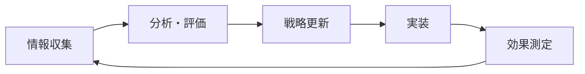

# 第7章：未来に備える

[← 第6章 - ケーススタディ](chapter-06-case-studies.md) | [付録 →](appendix.md)

## 概要

AI技術と検索の世界は急速に進化しています。この章では、今後予想される変化と、それらに対して柔軟に適応し続けるための長期戦略を解説します。将来の不確実性に対して、どのように準備し、持続可能な成長を実現するかを探ります。

## AI検索の進化予測

### 短期的展望（1-2年）

**1. マルチモーダル検索の主流化**
```python
# 将来の検索クエリ例
search_query = {
    "text": "この植物の名前は？",
    "image": "plant_photo.jpg",
    "context": {
        "location": "東京都",
        "season": "春",
        "environment": "公園"
    }
}

# AIの回答
response = {
    "plant_name": "ソメイヨシノ",
    "confidence": 0.95,
    "additional_info": {
        "blooming_period": "3月下旬-4月上旬",
        "care_tips": "...",
        "nearby_viewing_spots": ["上野公園", "新宿御苑"]
    }
}
```

**2. パーソナライゼーションの深化**
- 個人の検索履歴に基づく回答のカスタマイズ
- 専門レベルに応じた説明の調整
- 文化的背景を考慮した情報提供

**3. リアルタイムデータ統合**
- ライブイベントの即時反映
- 在庫情報や価格の動的更新
- 交通・天候情報の統合

### 中期的展望（3-5年）

**1. AIエージェントの進化**
```javascript
// 将来のAIエージェント機能
const aiAgent = {
  capabilities: {
    // 複雑なタスクの実行
    taskExecution: async (task) => {
      // 例：旅行計画の立案から予約まで
      const plan = await createTravelPlan(task.requirements);
      const bookings = await makeReservations(plan);
      return { plan, bookings, itinerary: generateItinerary(bookings) };
    },
    
    // 継続的な監視とアラート
    monitoring: {
      priceAlerts: true,
      competitorAnalysis: true,
      trendDetection: true
    },
    
    // プロアクティブな提案
    suggestions: {
      contentIdeas: true,
      optimizationOpportunities: true,
      businessInsights: true
    }
  }
};
```

**2. ゼロクリック検索の完成形**
- 90%以上の情報ニーズがAI内で完結
- インタラクティブな情報探索
- 動的な情報生成と視覚化

**3. 音声・AR/VR検索の普及**
- 音声対話による自然な情報取得
- AR眼鏡での現実世界オーバーレイ
- VR空間での没入型情報体験

### 長期的展望（5-10年）

**1. AGI（汎用人工知能）の影響**
- 人間レベルの理解と推論
- 創造的な問題解決
- 複雑な状況判断

**2. 量子コンピューティングの活用**
- 超高速な情報処理
- 複雑なパターン認識
- 新しい最適化アルゴリズム

**3. ブレインコンピューターインターフェース**
- 思考による直接検索
- 情報の直接脳内転送
- 認知能力の拡張

## 適応戦略の構築

### 1. アジャイル型コンテンツ戦略

**原則：**
- 変化に素早く対応できる体制
- 実験と学習の文化
- データドリブンな意思決定

**実装フレームワーク：**
```yaml
content_strategy:
  core_principles:
    - user_value_first
    - quality_over_quantity
    - continuous_improvement
  
  execution:
    sprint_cycle: 2_weeks
    review_frequency: weekly
    experimentation_quota: 20%
  
  metrics:
    - user_engagement
    - ai_visibility
    - business_impact
    - innovation_score
```

### 2. テクノロジースタックの現代化

**必須要素：**
```javascript
const modernTechStack = {
  // ヘッドレスCMS
  content: {
    cms: "Headless",
    api: "GraphQL",
    delivery: "Edge Computing"
  },
  
  // AIインテグレーション
  ai: {
    contentGeneration: "GPT-4+",
    imageProcessing: "DALL-E",
    analytics: "Custom ML Models"
  },
  
  // パフォーマンス
  performance: {
    rendering: "SSG + ISR",
    caching: "Multi-layer",
    optimization: "Automatic"
  },
  
  // データ基盤
  data: {
    warehouse: "Cloud Native",
    processing: "Real-time",
    privacy: "Privacy-first"
  }
};
```

### 3. 組織能力の強化

**重要スキルセット：**

**1. AIリテラシー**
- AI技術の理解と活用
- プロンプトエンジニアリング
- AIツールの選定と導入

**2. データサイエンス**
- 高度な分析能力
- 予測モデリング
- A/Bテストの設計

**3. クリエイティブ思考**
- 独自価値の創造
- ストーリーテリング
- ユーザー体験設計

**組織構造の進化：**
```
従来の組織
├── マーケティング部
├── 技術部
└── コンテンツ部

AI時代の組織
├── グロースチーム（部門横断）
│   ├── AIスペシャリスト
│   ├── データアナリスト
│   ├── UXデザイナー
│   └── コンテンツストラテジスト
├── イノベーションラボ
└── カスタマーサクセス
```

## 持続可能なビジネスモデル

### 1. 収益源の多様化

**推奨モデル：**
```python
revenue_streams = {
    # 直接収益
    "subscriptions": {
        "basic": "無料（広告付き）",
        "premium": "月額1,000円（広告なし、追加機能）",
        "enterprise": "カスタム価格（API、サポート）"
    },
    
    # 間接収益
    "data_insights": {
        "market_reports": "業界レポート販売",
        "trend_analysis": "トレンド分析サービス",
        "consulting": "コンサルティング"
    },
    
    # パートナーシップ
    "partnerships": {
        "ai_training_data": "AIモデル訓練用データ提供",
        "content_licensing": "コンテンツライセンス",
        "white_label": "ホワイトラベルソリューション"
    }
}
```

### 2. エコシステムの構築

**コミュニティ中心のアプローチ：**
- ユーザー生成コンテンツの促進
- 開発者向けAPIの提供
- パートナープログラムの展開

### 3. 価値創造の新しい形

**AIとの共創モデル：**
```javascript
// 人間とAIの協働例
const collaborativeCreation = {
  // コンテンツ作成
  content: {
    human: "アイデア、構成、検証",
    ai: "リサーチ、初稿、最適化"
  },
  
  // 製品開発
  product: {
    human: "ビジョン、UX設計、品質保証",
    ai: "プロトタイプ、テスト、改善提案"
  },
  
  // 顧客サービス
  service: {
    human: "複雑な問題解決、感情的サポート",
    ai: "初期対応、情報提供、ルーティン処理"
  }
};
```

## リスク管理と倫理的配慮

### 1. 技術的リスク

**対策マトリックス：**
| リスク | 影響度 | 対策 |
|--------|--------|------|
| AI依存 | 高 | 多様な流入源確保 |
| アルゴリズム変更 | 高 | 継続的モニタリング |
| データ喪失 | 中 | 定期バックアップ |
| サイバー攻撃 | 高 | セキュリティ強化 |

### 2. 倫理的ガイドライン

**原則：**
1. **透明性** - AIの使用を明示
2. **公平性** - バイアスの排除
3. **プライバシー** - データ保護の徹底
4. **責任** - 生成コンテンツへの責任

**実装例：**
```html
<!-- AI使用の明示 -->
<div class="ai-disclosure">
  <p>このコンテンツの一部はAIの支援を受けて作成されています。
     人間の専門家により検証・編集されています。</p>
  <details>
    <summary>詳細情報</summary>
    <p>使用AI: GPT-4</p>
    <p>最終レビュー: 2024年3月15日</p>
    <p>レビュアー: 山田太郎（認定専門家）</p>
  </details>
</div>
```

### 3. 規制への対応

**予想される規制：**
- AI生成コンテンツの表示義務
- データ使用の透明性要求
- アルゴリズム監査の必要性

## 実践的な準備アクション

### フェーズ1：基盤構築（現在-6ヶ月）

**チェックリスト：**
- [ ] 現在の技術スタック評価
- [ ] チームスキルのアセスメント
- [ ] AIツールの試験導入
- [ ] データ収集体制の確立
- [ ] KPIの再定義

### フェーズ2：実験と学習（6-12ヶ月）

**重点項目：**
```python
experiments = [
    {
        "name": "AI共創コンテンツ",
        "duration": "3ヶ月",
        "metrics": ["品質", "効率", "ユーザー反応"],
        "success_criteria": "従来比30%改善"
    },
    {
        "name": "新収益モデル",
        "duration": "6ヶ月",
        "metrics": ["収益", "顧客満足度", "継続率"],
        "success_criteria": "月額収益20%増"
    }
]
```

### フェーズ3：スケール（12ヶ月以降）

**拡大戦略：**
1. 成功パターンの横展開
2. 自動化の推進
3. パートナーシップ拡大
4. 新市場への展開

## 未来への投資優先順位

### 高優先度投資

1. **人材育成**
   - AI/MLスキルトレーニング
   - クリエイティブ思考力強化
   - データリテラシー向上

2. **技術基盤**
   - クラウドネイティブ化
   - APIファースト設計
   - セキュリティ強化

3. **イノベーション**
   - R&D予算の確保
   - 実験的プロジェクト
   - スタートアップ連携

### 投資配分の目安

```
年間予算配分（推奨）
├── 人材・教育: 30%
├── 技術インフラ: 25%
├── コンテンツ・UX: 20%
├── マーケティング: 15%
└── R&D・実験: 10%
```

## 継続的な学習と適応

### 情報収集の仕組み

**定期的なインプット：**
- AI研究論文のモニタリング
- 業界カンファレンスへの参加
- 競合・先進事例の分析
- ユーザーフィードバックの収集

### アップデートサイクル



## 重要なポイント

- 変化は加速し続ける - 適応力が生存の鍵
- 人間の創造性とAIの能力を組み合わせる
- ユーザー価値を中心に据え続ける
- 実験と学習の文化を醸成する
- 倫理的配慮を怠らない
- 長期視点を持ちながら短期で実行する

## 実践的アクションアイテム

1. **未来予測ワークショップ（1ヶ月以内）**
   - チーム全体での将来シナリオ検討
   - 機会とリスクの洗い出し
   - 対応戦略の立案

2. **スキル開発計画（3ヶ月以内）**
   - 現在のスキルギャップ分析
   - 学習ロードマップ作成
   - 外部リソースの活用計画

3. **実験プロジェクト開始（6ヶ月以内）**
   - パイロットプロジェクトの選定
   - 成功指標の設定
   - リソース配分

4. **パートナーシップ構築（継続的）**
   - AI企業との連携模索
   - 業界団体への参加
   - 知識共有ネットワーク構築

---

[← 第6章 - ケーススタディ](chapter-06-case-studies.md) | [付録 →](appendix.md)