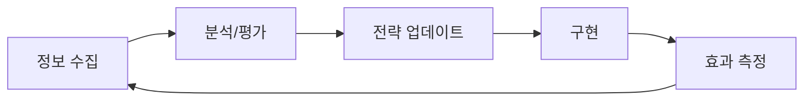

# 7장: 미래를 대비하기

[← 6장 - 사례 연구](chapter-06-case-studies.md) | [부록 →](appendix.md)

## 개요

AI 기술과 검색의 세계는 빠르게 진화하고 있습니다. 이 장에서는 앞으로 예상되는 변화와 이에 유연하게 적응하기 위한 장기 전략을 설명합니다. 미래의 불확실성에 대비하여 어떻게 준비하고 지속 가능한 성장을 실현할지 탐구합니다.

## AI 검색의 진화 예측

### 단기 전망 (1-2년)

**1. 멀티모달 검색의 주류화**
```python
# 미래의 검색 쿼리 예시
search_query = {
    "text": "이 식물의 이름은?",
    "image": "plant_photo.jpg",
    "context": {
        "location": "서울",
        "season": "봄",
        "environment": "공원"
    }
}

# AI의 응답
response = {
    "plant_name": "벚꽃",
    "confidence": 0.95,
    "additional_info": {
        "blooming_period": "3월 말-4월 초",
        "care_tips": "...",
        "nearby_viewing_spots": ["여의도 공원", "서울숲"]
    }
}
```

**2. 개인화의 심화**
- 개인 검색 이력 기반 답변 맞춤화
- 전문 수준에 따른 설명 조정
- 문화적 배경을 고려한 정보 제공

**3. 실시간 데이터 통합**
- 라이브 이벤트의 즉시 반영
- 재고 정보와 가격의 동적 업데이트
- 교통/날씨 정보 통합

### 중기 전망 (3-5년)

**1. AI 에이전트의 진화**
```javascript
// 미래의 AI 에이전트 기능
const aiAgent = {
  capabilities: {
    // 복잡한 작업 실행
    taskExecution: async (task) => {
      // 예: 여행 계획 수립부터 예약까지
      const plan = await createTravelPlan(task.requirements);
      const bookings = await makeReservations(plan);
      return { plan, bookings, itinerary: generateItinerary(bookings) };
    },
    
    // 지속적 모니터링과 알림
    monitoring: {
      priceAlerts: true,
      competitorAnalysis: true,
      trendDetection: true
    },
    
    // 프로액티브 제안
    suggestions: {
      contentIdeas: true,
      optimizationOpportunities: true,
      businessInsights: true
    }
  }
};
```

**2. 제로 클릭 검색의 완성**
- 90% 이상의 정보 니즈가 AI 내에서 완결
- 인터랙티브한 정보 탐색
- 동적 정보 생성과 시각화

**3. 음성/AR/VR 검색의 보급**
- 음성 대화를 통한 자연스러운 정보 획득
- AR 안경에서의 현실 세계 오버레이
- VR 공간에서의 몰입형 정보 경험

### 장기 전망 (5-10년)

**1. AGI(범용 인공지능)의 영향**
- 인간 수준의 이해와 추론
- 창의적인 문제 해결
- 복잡한 상황 판단

**2. 양자 컴퓨팅 활용**
- 초고속 정보 처리
- 복잡한 패턴 인식
- 새로운 최적화 알고리즘

**3. 뇌-컴퓨터 인터페이스**
- 생각으로 직접 검색
- 정보의 직접 뇌내 전송
- 인지 능력 확장

## 적응 전략 구축

### 1. 애자일 콘텐츠 전략

**원칙:**
- 변화에 빠르게 대응할 수 있는 체제
- 실험과 학습의 문화
- 데이터 기반 의사결정

**구현 프레임워크:**
```yaml
content_strategy:
  core_principles:
    - user_value_first
    - quality_over_quantity
    - continuous_improvement
  
  execution:
    sprint_cycle: 2_weeks
    review_frequency: weekly
    experimentation_quota: 20%
  
  metrics:
    - user_engagement
    - ai_visibility
    - business_impact
    - innovation_score
```

### 2. 기술 스택 현대화

**필수 요소:**
```javascript
const modernTechStack = {
  // 헤드리스 CMS
  content: {
    cms: "Headless",
    api: "GraphQL",
    delivery: "Edge Computing"
  },
  
  // AI 통합
  ai: {
    contentGeneration: "GPT-4+",
    imageProcessing: "DALL-E",
    analytics: "Custom ML Models"
  },
  
  // 성능
  performance: {
    rendering: "SSG + ISR",
    caching: "Multi-layer",
    optimization: "Automatic"
  },
  
  // 데이터 기반
  data: {
    warehouse: "Cloud Native",
    processing: "Real-time",
    privacy: "Privacy-first"
  }
};
```

### 3. 조직 역량 강화

**중요 기술 세트:**

**1. AI 리터러시**
- AI 기술 이해와 활용
- 프롬프트 엔지니어링
- AI 도구 선정과 도입

**2. 데이터 사이언스**
- 고급 분석 능력
- 예측 모델링
- A/B 테스트 설계

**3. 창의적 사고**
- 독자적 가치 창출
- 스토리텔링
- 사용자 경험 설계

**조직 구조의 진화:**
```
기존 조직
├── 마케팅부
├── 기술부
└── 콘텐츠부

AI 시대 조직
├── 성장팀 (부서 간 협업)
│   ├── AI 전문가
│   ├── 데이터 분석가
│   ├── UX 디자이너
│   └── 콘텐츠 전략가
├── 혁신 랩
└── 고객 성공팀
```

## 지속 가능한 비즈니스 모델

### 1. 수익원 다각화

**권장 모델:**
```python
revenue_streams = {
    # 직접 수익
    "subscriptions": {
        "basic": "무료 (광고 포함)",
        "premium": "월 10,000원 (광고 없음, 추가 기능)",
        "enterprise": "맞춤 가격 (API, 지원)"
    },
    
    # 간접 수익
    "data_insights": {
        "market_reports": "업계 보고서 판매",
        "trend_analysis": "트렌드 분석 서비스",
        "consulting": "컨설팅"
    },
    
    # 파트너십
    "partnerships": {
        "ai_training_data": "AI 모델 훈련용 데이터 제공",
        "content_licensing": "콘텐츠 라이선스",
        "white_label": "화이트라벨 솔루션"
    }
}
```

### 2. 생태계 구축

**커뮤니티 중심 접근:**
- 사용자 생성 콘텐츠 촉진
- 개발자를 위한 API 제공
- 파트너 프로그램 전개

### 3. 가치 창출의 새로운 형태

**AI와의 공동 창작 모델:**
```javascript
// 인간과 AI의 협업 예시
const collaborativeCreation = {
  // 콘텐츠 제작
  content: {
    human: "아이디어, 구성, 검증",
    ai: "리서치, 초안, 최적화"
  },
  
  // 제품 개발
  product: {
    human: "비전, UX 설계, 품질 보증",
    ai: "프로토타입, 테스트, 개선 제안"
  },
  
  // 고객 서비스
  service: {
    human: "복잡한 문제 해결, 감정적 지원",
    ai: "초기 대응, 정보 제공, 루틴 처리"
  }
};
```

## 리스크 관리와 윤리적 고려사항

### 1. 기술적 리스크

**대책 매트릭스:**
| 리스크 | 영향도 | 대책 |
|--------|--------|------|
| AI 의존 | 높음 | 다양한 유입원 확보 |
| 알고리즘 변경 | 높음 | 지속적 모니터링 |
| 데이터 손실 | 중간 | 정기 백업 |
| 사이버 공격 | 높음 | 보안 강화 |

### 2. 윤리적 가이드라인

**원칙:**
1. **투명성** - AI 사용 명시
2. **공정성** - 편견 배제
3. **프라이버시** - 데이터 보호 철저
4. **책임** - 생성 콘텐츠에 대한 책임

**구현 예시:**
```html
<!-- AI 사용 명시 -->
<div class="ai-disclosure">
  <p>이 콘텐츠의 일부는 AI의 도움을 받아 작성되었습니다.
     인간 전문가에 의해 검증 및 편집되었습니다.</p>
  <details>
    <summary>상세 정보</summary>
    <p>사용 AI: GPT-4</p>
    <p>최종 검토: 2024년 3월 15일</p>
    <p>검토자: 김철수 (인증 전문가)</p>
  </details>
</div>
```

### 3. 규제 대응

**예상되는 규제:**
- AI 생성 콘텐츠의 표시 의무
- 데이터 사용의 투명성 요구
- 알고리즘 감사 필요성

## 실천적 준비 액션

### 1단계: 기반 구축 (현재-6개월)

**체크리스트:**
- [ ] 현재 기술 스택 평가
- [ ] 팀 기술 평가
- [ ] AI 도구 시범 도입
- [ ] 데이터 수집 체계 구축
- [ ] KPI 재정의

### 2단계: 실험과 학습 (6-12개월)

**중점 항목:**
```python
experiments = [
    {
        "name": "AI 공동 창작 콘텐츠",
        "duration": "3개월",
        "metrics": ["품질", "효율", "사용자 반응"],
        "success_criteria": "기존 대비 30% 개선"
    },
    {
        "name": "새로운 수익 모델",
        "duration": "6개월",
        "metrics": ["수익", "고객 만족도", "유지율"],
        "success_criteria": "월 수익 20% 증가"
    }
]
```

### 3단계: 확장 (12개월 이후)

**확장 전략:**
1. 성공 패턴의 수평 전개
2. 자동화 추진
3. 파트너십 확대
4. 새로운 시장 진출

## 미래 투자 우선순위

### 높은 우선순위 투자

1. **인재 육성**
   - AI/ML 기술 교육
   - 창의적 사고력 강화
   - 데이터 리터러시 향상

2. **기술 기반**
   - 클라우드 네이티브화
   - API 우선 설계
   - 보안 강화

3. **혁신**
   - R&D 예산 확보
   - 실험적 프로젝트
   - 스타트업 연계

### 투자 배분 권장안

```
연간 예산 배분 (권장)
├── 인재/교육: 30%
├── 기술 인프라: 25%
├── 콘텐츠/UX: 20%
├── 마케팅: 15%
└── R&D/실험: 10%
```

## 지속적인 학습과 적응

### 정보 수집 체계

**정기적 인풋:**
- AI 연구 논문 모니터링
- 업계 컨퍼런스 참가
- 경쟁사/선진 사례 분석
- 사용자 피드백 수집

### 업데이트 사이클



## 핵심 포인트

- 변화는 계속 가속화될 것 - 적응력이 생존의 열쇠
- 인간의 창의성과 AI의 능력을 결합하라
- 사용자 가치를 중심에 두고 계속하라
- 실험과 학습의 문화를 조성하라
- 윤리적 고려사항을 소홀히 하지 마라
- 장기적 관점을 갖되 단기적으로 실행하라

## 실천 가능한 액션 아이템

1. **미래 예측 워크숍 (1개월 이내)**
   - 팀 전체의 미래 시나리오 검토
   - 기회와 리스크 파악
   - 대응 전략 수립

2. **기술 개발 계획 (3개월 이내)**
   - 현재 기술 격차 분석
   - 학습 로드맵 작성
   - 외부 리소스 활용 계획

3. **실험 프로젝트 시작 (6개월 이내)**
   - 파일럿 프로젝트 선정
   - 성공 지표 설정
   - 리소스 배분

4. **파트너십 구축 (지속적)**
   - AI 기업과의 협력 모색
   - 업계 단체 참여
   - 지식 공유 네트워크 구축

---

[← 6장 - 사례 연구](chapter-06-case-studies.md) | [부록 →](appendix.md)