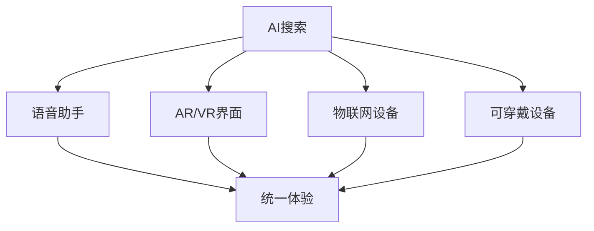

# 第七章：面向未来的策略

## 在AI驱动的未来中建立韧性

搜索中唯一不变的就是变化。本章重点介绍建立适应性策略，帮助您的网站无论AI搜索如何发展都能蓬勃发展。

## 预测未来搜索趋势

### AI搜索的演变

**当前状态（2024年）：**
- 信息查询的AI概览
- 有限的个性化
- 基于文本的响应
- 基于引用的信任

**近期未来（2025-2026年）：**
- 对话式搜索界面
- 多模态AI响应
- 个性化AI助手
- 实时数据集成

**长期愿景（2027年+）：**
- 预测搜索需求
- 增强现实集成
- 语音优先界面
- AI到AI通信

### 新兴搜索行为

**用户期望的转变：**

1. **零点击满足**
   - SERP中的完整答案
   - 互动式AI响应
   - 动态信息更新
   - 个性化摘要

2. **对话式查询**
   ```
   传统："2024最佳笔记本电脑"
   对话式："我需要一台1500美元以下的
   便携式视频编辑笔记本电脑"
   ```

3. **多步互动**
   - 后续问题
   - 细化查询
   - 上下文保留
   - 任务完成焦点

### 技术融合

**AI + 其他技术：**



## 建立适应性策略

### 反脆弱SEO框架

**核心原则：**

1. **多样化胜过专业化**
   - 多种内容格式
   - 各种流量来源
   - 不同的货币化方法
   - 平台独立性

2. **持续学习系统**
   ```python
   # 概念性适应循环
   while search_evolving:
       monitor_changes()
       analyze_impact()
       test_responses()
       implement_winners()
       document_learnings()
   ```

3. **实验文化**
   - 20%资源用于测试
   - 快速失败方法论
   - 数据驱动决策
   - 公开分享学习成果

### 内容策略演变

**CREATE框架：**

**C**omprehensive - 全面覆盖
- 完整的主题权威
- 回答所有相关问题
- 多角度包含

**R**eal-time - 实时相关性
- 动态内容更新
- API驱动的数据
- 用户生成的新鲜度

**E**ngagement - 参与优化
- 互动元素
- 个性化选项
- 社区功能

**A**daptive - 适应性格式
- 文本、视频、音频、AR
- 设备特定版本
- 默认可访问性

**T**rust - 信任建设
- 透明的方法论
- 可验证的资质
- 用户推荐
- 第三方验证

**E**xperimental - 实验心态
- 测试新格式
- 开拓平台
- 拥抱变化

### 技术适应性

**面向未来的架构：**

1. **无头CMS实施**
   ```javascript
   // API优先的内容交付
   const contentAPI = {
     async getContent(query, format) {
       const content = await fetch(`/api/content/${query}`);
       return formatContent(content, format);
     }
   };
   ```

2. **微服务方法**
   - 模块化组件
   - 独立扩展
   - 技术无关
   - 易于更新

3. **边缘计算就绪**
   - 全球CDN部署
   - 无服务器功能
   - 实时处理
   - 边缘个性化

## 多样化流量来源

### 超越Google策略

**流量来源组合：**

```
理想分布：
- 自然搜索：40%
- 直接流量：20%
- 社交媒体：15%
- 电子邮件：10%
- 引荐：10%
- 其他：5%
```

### 替代搜索引擎

**优化优先级：**

1. **必应/微软**
   - 不同的排名因素
   - 必应网站管理员工具
   - Microsoft Clarity
   - LinkedIn集成

2. **DuckDuckGo**
   - 以隐私为中心的内容
   - 无个性化
   - 技术卓越
   - 清晰的信息

3. **垂直搜索引擎**
   - 亚马逊（产品）
   - YouTube（视频）
   - Pinterest（视觉）
   - Reddit（讨论）

### 社交媒体演变

**平台特定策略：**

**TikTok SEO：**
- 标签优化
- 趋势音频使用
- 原生内容创建
- 影响者合作

**LinkedIn优化：**
- 长篇文章
- 专业见解
- 行业关键词
- 网络效应

**Instagram发现：**
- Reels优化
- 故事亮点
- 购物标签
- 位置标签

### 建立直接关系

**电子邮件列表策略：**

1. **价值优先方法**
   ```html
   <!-- 高转化选择加入 -->
   <div class="opt-in-form">
     <h3>获取每周AI搜索更新</h3>
     <p>博客上未发布的独家见解</p>
     <form>
       <input type="email" placeholder="您的电子邮件">
       <button>获取免费更新</button>
     </form>
   </div>
   ```

2. **社区建设**
   - Discord服务器
   - Slack社区
   - 论坛创建
   - 虚拟活动

3. **应用开发**
   - 移动应用
   - 浏览器扩展
   - 桌面工具
   - API访问

## 持续学习和调整

### 监控系统

**基本跟踪设置：**

1. **AI特定指标仪表板**
   ```javascript
   const aiMetrics = {
     overviewAppearances: trackAIAppearances(),
     citationRate: measureCitations(),
     zeroClickImpact: calculateZeroClicks(),
     voiceSearchShare: trackVoiceQueries(),
     featuredSnippets: monitorSnippets()
   };
   ```

2. **竞争情报**
   - AI可见性跟踪
   - 内容差距分析
   - 技术比较
   - 策略监控

3. **用户行为分析**
   - 搜索旅程映射
   - 参与模式
   - 转化路径
   - 反馈循环

### 实验框架

**结构化测试方法：**

1. **假设发展**
   - 基于数据见解
   - 明确的成功指标
   - 定义的时间框架
   - 风险评估

2. **测试实施**
   ```markdown
   ## 测试：对话式内容格式
   
   假设：对话格式增加AI引用
   
   对照组：传统文章格式
   变体：问答对话风格
   
   指标：
   - AI出现率
   - 引用频率
   - 用户参与度
   - 转化影响
   
   持续时间：4周
   样本大小：10,000个会话
   ```

3. **学习文档**
   - 测试结果
   - 获得的见解
   - 实施指南
   - 失败教训

### 团队发展

**未来的技能：**

1. **技术技能**
   - AI/ML基础
   - 数据分析
   - 编程基础
   - API集成

2. **软技能**
   - 适应性
   - 批判性思维
   - 创造性解决问题
   - 持续学习

3. **跨职能知识**
   - UX原则
   - 内容策略
   - 技术SEO
   - 数据科学

## 建立长期权威

### 信任方程式

```
权威 = 专业知识 × 一致性 × 时间 × 验证
```

**构建模块：**

1. **专业知识发展**
   - 原创研究
   - 行业合作伙伴关系
   - 演讲活动
   - 发表论文

2. **一致性维护**
   - 定期发布
   - 质量标准
   - 品牌指南
   - 更新时间表

3. **时间投资**
   - 长期思维
   - 复合效应
   - 关系建设
   - 声誉管理

4. **验证系统**
   - 第三方审核
   - 行业认证
   - 用户推荐
   - 案例研究文档

### 面向未来的内容支柱

**常青+及时策略：**

1. **基础内容（70%）**
   - 综合指南
   - 教育资源
   - 参考材料
   - 工具集合

2. **趋势内容（20%）**
   - 新闻报道
   - 行业更新
   - 季节性内容
   - 活动报道

3. **实验内容（10%）**
   - 新格式
   - 新兴平台
   - 测试功能
   - 创新测试

## 未来行动计划

### 90天冲刺

**第1-30天：基础**
- 审核当前漏洞
- 实施监控系统
- 开始多样化努力
- 团队培训启动

**第31-60天：实验**
- 启动测试活动
- 尝试新内容格式
- 探索新平台
- 收集初始数据

**第61-90天：优化**
- 分析测试结果
- 扩大成功策略
- 记录学习成果
- 计划下一个冲刺

### 年度规划

**第一季度：评估**
- 上一年回顾
- 市场分析
- 策略调整
- 资源分配

**第二季度：实施**
- 新举措启动
- 团队发展
- 技术升级
- 合作伙伴关系建设

**第三季度：加速**
- 扩大成功
- 优化运营
- 扩展覆盖范围
- 深化参与

**第四季度：演进**
- 未来规划
- 创新测试
- 知识分享
- 基础设置

## 关键要点

- 搜索的未来是对话式的、多模态的和AI驱动的
- 适应性和实验是生存技能
- 多样化减少平台依赖风险
- 建立直接关系提供稳定性
- 持续学习是不可协商的
- 权威建设是长期投资
- 成功需要规划和灵活性

---

*下一页：[附录：资源和工具 →](appendix.md)*